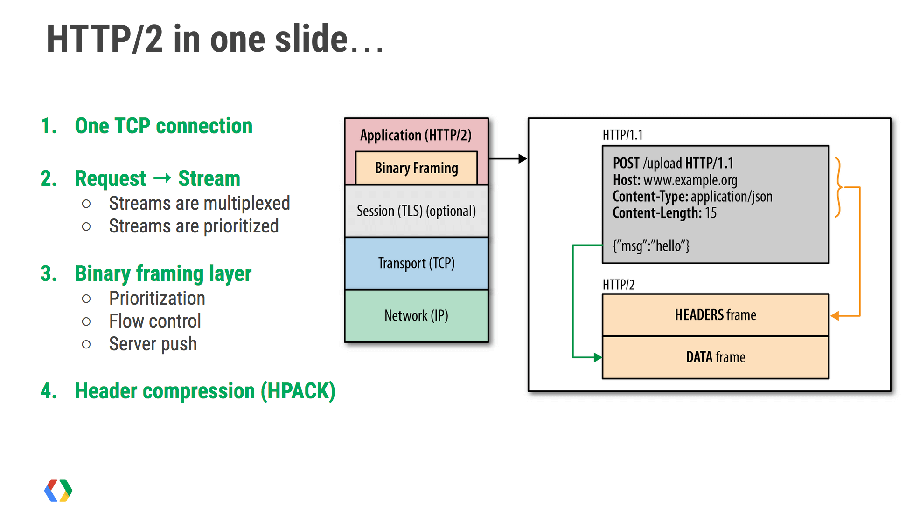
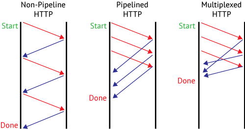
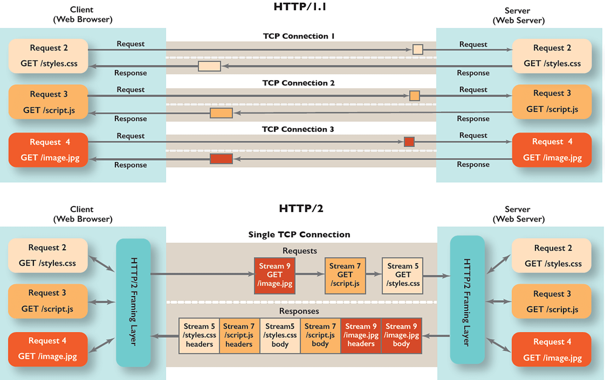
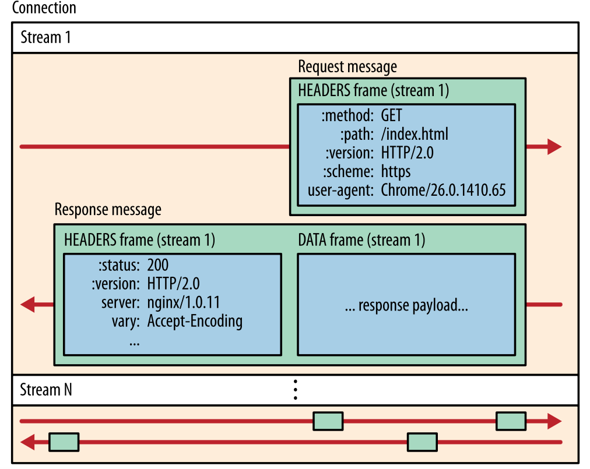

# nghttp http server 分享

# 1. High Level Http Frameworks
简单分析一下下面这几个http框架：
* std http package
* docker http
* gin

对于使用go的http框架， 特点在于：
* 一个特殊的函数签名 - handler
* 对于中间件的实现 - middleware
* 路由的实现 - router

## 1.1 go std lib http package

### An Example
用go搭建一个可用的http服务
```go
package main

import (
	"fmt"
	"html"
	"log"
	"net/http"
	"time"
)

func main() {
	var biMux = http.NewServeMux()
	biMux.HandleFunc("/hello", hello)
	biMux.HandleFunc("/world", world)

	s := &http.Server{
		Addr:           ":8080",
		Handler:        biMux,
		ReadTimeout:    10 * time.Second,
		WriteTimeout:   10 * time.Second,
		MaxHeaderBytes: 1 << 20,
	}

	log.Fatal(s.ListenAndServe())
}

func hello(w http.ResponseWriter, r *http.Request) {
	fmt.Fprintf(w, "Hello, %q", html.EscapeString(r.URL.Path))
}

func world(w http.ResponseWriter, r *http.Request) {
	w.Write([]byte("world"))
}
```

无路由版本：
```go
func main(){
    db := database{"shoes":50, "socks":5}
    log.Fatal(http.ListenAndServe("localhost:8000", db))
}

type databases map[string]dollars

func (db databases) ServeHttp(w ResponseWriter, r *Request) {
    for item, price := range db {
        fmt.Fprintf(w, "%s: %s\n", item, price)
    }
}
```

主要做的事情就是三件：
* 创建server对象
* 定义handler
* 初始化路由

### Basics
* 什么是router?
router就是一个特殊的handler， 一个server可以绑定一个handler， 而这个handler往往就是router， 否则http服务只会支持唯一一个URL

* 什么是handler？

关于handler的定义：
```go
type Handler interface {
	ServerHTTP(w ResponseWriter, r *Request)
}
```
* 实现了Handler interface的类型都是handler
* 为什么函数也是handler? 函数也是对象， 有特殊函数签名的函数都属于`type HandlerFunc`

```go
type HandlerFunc func(ResponseWriter, *Request)

// ServeHTTP calls f(w, r).
func (f HandlerFunc) ServeHTTP(w ResponseWriter, r *Request) {
	f(w, r)
}
```
* 为什么路由也是handler？ 因为router也实现了`type Handler interface`
```go
func (mux *ServeMux) ServeHTTP(w ResponseWriter, r *Request) {
	if r.RequestURI == "*" {
		if r.ProtoAtLeast(1, 1) {
			w.Header().Set("Connection", "close")
		}
		w.WriteHeader(StatusBadRequest)
		return
	}
	h, _ := mux.Handler(r)
	h.ServeHTTP(w, r)
}
```

### Top Down View
创建server的底层实现就是listner accept那一套， 不过server还支持不少与http相关的额外功能， 比如说各种timeout， 这些会影响到listener accetp的逻辑， go std lib是这样做的：

`
    |listen fd| -> 
a. server accept -> 
    |socket fd/conn| -> 
b. goroutine handle -> 
c. read -> 
    |bytes| -> 
d. parse -> 
    |http request/response, w and r| ->
e. mux/route/handle ->
    |still w and r| ->
f. find real handler ->
    |still w and r| ->
g. real handler handle ->
h. read request and send response
`


```go
func (srv *Server) ListenAndServe() error {
	if srv.shuttingDown() {
		return ErrServerClosed
	}
	addr := srv.Addr
	if addr == "" {
		addr = ":http"
	}
	ln, err := net.Listen("tcp", addr)
	if err != nil {
		return err
	}
	return srv.Serve(ln)
}
// a. server accept
func (srv *Server) Serve(l net.Listener) error {
    ...
    for {
        rw, err := l.Accept()
        if err != nil {
            select {
            case <-srv.getDoneChan():
                return ErrServerClosed
            default:
            }
        ...
        }
// b. goroutine handle
        go c.serve(connCtx)
    }
}

func (c *conn) serve(ctx context.Context) {
// c. read
    w, err := c.readRequest(ctx)
    ...
    serverHandler{c.server}.ServeHTTP(w, w.req)
    ...
}

// d. parse
func readRequest() {
    ...
    req.Method, req.RequestURI, req.Proto, ok = parseRequestLine(s)
    ...
}

// e. mux/route/handle
func (sh serverHandler) ServeHTTP(rw ResponseWriter, req *Request) {
	handler := sh.srv.Handler
    ...
	handler.ServeHTTP(rw, req)
}

// f. find real handler
func (mux *ServeMux) ServeHTTP(w ResponseWriter, r *Request) {
	if r.RequestURI == "*" {
		if r.ProtoAtLeast(1, 1) {
			w.Header().Set("Connection", "close")
		}
		w.WriteHeader(StatusBadRequest)
		return
	}
	h, _ := mux.Handler(r)
// g. real handler handle
	h.ServeHTTP(w, r)
}

func (mux *ServeMux) handler(host, path string) (h Handler, pattern string) {
    ...
	if mux.hosts {
		h, pattern = mux.match(host + path)
	}
	if h == nil {
		h, pattern = mux.match(path)
	}
	if h == nil {
		h, pattern = NotFoundHandler(), ""
	}
    ...
}

// h. read request and send response
func world(w http.ResponseWriter, r *http.Request) {
	w.Write([]byte("world"))
}
```

### middleware
如果需要给原来的API加上一个认证功能， 那么只需要添加一个用于认证的中间件， 如果不需要认证功能了， 就把中间件去掉。 

* go的一种中间件的实现是用了函数的闭包（closure）, 这里的next参数都逃逸成为堆上的自由变量。

* 另外一种常见的实现使用函数数组的形式， 比如gin

```shell
     ┌─────────┐
     │ context │
     └─────────┘
          │
┌ ─ ─ ─ ─ ┼ ─ ─ ─ ─ ┐
          ▼
│  ┌─────────────┐  │
   │   HandlerA  │
│  └─────────────┘  │
          │
│         ▼         │
   ┌─────────────┐
   │   HandlerB  │
   └─────────────┘
│         │         │
          ▼
│  ┌─────────────┐  │
   │   HandlerC  │
│  └─────────────┘  │
          │
└ ─ ─ ─ ─ ┼ ─ ─ ─ ─ ┘
          │
          ▼
```

```go
// Use adds middleware to the group, see example code in GitHub.
func (group *RouterGroup) Use(middleware ...HandlerFunc) IRoutes {
	group.Handlers = append(group.Handlers, middleware...)
	return group.returnObj()
}
```

这里是一种使用闭包的中间件：  
```go
func middlewareOne(next http.Handler) http.Handler {
	return http.HandlerFunc(func(w http.ResponseWriter, r *http.Request) {
		log.Print("Executing middlewareOne")
		next.ServeHTTP(w, r)
		log.Print("Executing middlewareOne again")
	})
}

func middlewareTwo(next http.Handler) http.Handler {
	return http.HandlerFunc(func(w http.ResponseWriter, r *http.Request) {
		log.Print("Executing middlewareTwo")
		if r.URL.Path == "/foo" {
			return
		}

		next.ServeHTTP(w, r)
		log.Print("Executing middlewareTwo again")
	})
}

func final(w http.ResponseWriter, r *http.Request) {
	log.Print("Executing finalHandler")
	w.Write([]byte("OK"))
}

func main() {
	mux := http.NewServeMux()

	finalHandler := http.HandlerFunc(final)
	mux.Handle("/", middlewareOne(middlewareTwo(finalHandler)))

	log.Print("Listening on :3000...")
	err := http.ListenAndServe(":3000", mux)
	log.Fatal(err)
}	
```

```shell
$ go run main.go
Listening on :3000...
Executing middlewareOne
Executing middlewareTwo
Executing finalHandler
Executing middlewareTwo again
Executing middlewareOne again
```

## 1.2 moby http server
```shell
.
├── backend
│   └── build
├── errorhandler.go
├── httpstatus
│   └── status.go
├── httputils
│   ├── decoder.go
│   ├── form.go
│   ├── form_test.go
│   ├── httputils.go
│   ├── httputils_test.go
│   └── write_log_stream.go
├── middleware
│   ├── cors.go
│   ├── debug.go
│   ├── debug_test.go
│   ├── experimental.go
│   ├── middleware.go
│   ├── version.go
│   └── version_test.go
├── middleware.go
├── router
│   ├── build
│   ├── checkpoint
│   ├── container
│   ├── debug
│   ├── distribution
│   ├── experimental.go
│   ├── grpc
│   ├── image
│   ├── local.go
│   ├── network
│   ├── plugin
│   ├── router.go
│   ├── session
│   ├── swarm
│   ├── system
│   └── volume
├── server.go
└── server_test.go
```

比较重要的代码在：
* server.go http server实现
* router/* 所有的handler
* middleware/* 一些中间件的实现

一些特点：
* 新的Handler定义 `APIFunc`
```go
// APIFunc is an adapter to allow the use of ordinary functions as Docker API endpoints.
// Any function that has the appropriate signature can be registered as an API endpoint (e.g. getVersion).
type APIFunc func(ctx context.Context, w http.ResponseWriter, r *http.Request, vars map[string]string) error
```
* 中间件的实现：
```go 
func middleware(f APIFunc) APIFunc {
	return func(ctx, w, r, vars) error {
		// do something
		return f(ctx, w, r, vars)
	}
}
```

```go
// WrapHandler returns a new handler function wrapping the previous one in the request chain.
func (c CORSMiddleware) WrapHandler(handler func(ctx context.Context, w http.ResponseWriter, r *http.Request, vars map[string]string) error) func(ctx context.Context, w http.ResponseWriter, r *http.Request, vars map[string]string) error {
	return func(ctx context.Context, w http.ResponseWriter, r *http.Request, vars map[string]string) error {
		// If "api-cors-header" is not given, but "api-enable-cors" is true, we set cors to "*"
		// otherwise, all head values will be passed to HTTP handler
		corsHeaders := c.defaultHeaders
		if corsHeaders == "" {
			corsHeaders = "*"
		}

		logrus.Debugf("CORS header is enabled and set to: %s", corsHeaders)
		w.Header().Add("Access-Control-Allow-Origin", corsHeaders)
		w.Header().Add("Access-Control-Allow-Headers", "Origin, X-Requested-With, Content-Type, Accept, X-Registry-Auth")
		w.Header().Add("Access-Control-Allow-Methods", "HEAD, GET, POST, DELETE, PUT, OPTIONS")
		return handler(ctx, w, r, vars)
	}
}

```
* 使用功能更丰富的router
```go
func (r *containerRouter) initRoutes() {
	r.routes = []router.Route{
		// HEAD
		router.NewHeadRoute("/containers/{name:.*}/archive", r.headContainersArchive),
		// GET
		router.NewGetRoute("/containers/json", r.getContainersJSON),
		router.NewGetRoute("/containers/{name:.*}/export", r.getContainersExport),
		router.NewGetRoute("/containers/{name:.*}/changes", r.getContainersChanges),
		router.NewGetRoute("/containers/{name:.*}/json", r.getContainersByName),
		router.NewGetRoute("/containers/{name:.*}/top", r.getContainersTop),
		router.NewGetRoute("/containers/{name:.*}/logs", r.getContainersLogs),
		router.NewGetRoute("/containers/{name:.*}/stats", r.getContainersStats),
		router.NewGetRoute("/containers/{name:.*}/attach/ws", r.wsContainersAttach),
		router.NewGetRoute("/exec/{id:.*}/json", r.getExecByID),
		router.NewGetRoute("/containers/{name:.*}/archive", r.getContainersArchive),
		...
	}
}
```
* handler定义
```go
func (s *containerRouter) getContainersJSON(ctx context.Context, w http.ResponseWriter, r *http.Request, vars map[string]string) error {
	if err := httputils.ParseForm(r); err != nil {
		return err
	}
	filter, err := filters.FromJSON(r.Form.Get("filters"))
	if err != nil {
		return err
	}

	config := &types.ContainerListOptions{
		All:     httputils.BoolValue(r, "all"),
		Size:    httputils.BoolValue(r, "size"),
		Since:   r.Form.Get("since"),
		Before:  r.Form.Get("before"),
		Filters: filter,
	}

	if tmpLimit := r.Form.Get("limit"); tmpLimit != "" {
		limit, err := strconv.Atoi(tmpLimit)
		if err != nil {
			return err
		}
		config.Limit = limit
	}

	containers, err := s.backend.Containers(config)
	if err != nil {
		return err
	}

	return httputils.WriteJSON(w, http.StatusOK, containers)
}
```

### 1.3 gin
一些特点：
* 封装起来的request， response context
```go
type Handler interface {
	ServeHTTP(*gin.context)
}
```
* 丰富的响应序列化方法
```go
var (
    JSON          = jsonBinding{}
    XML           = xmlBinding{}
    Form          = formBinding{}
    Query         = queryBinding{}
    FormPost      = formPostBinding{}
    FormMultipart = formMultipartBinding{}
    ProtoBuf      = protobufBinding{}
    MsgPack       = msgpackBinding{}
    YAML          = yamlBinding{}
    Uri           = uriBinding{}
    Header        = headerBinding{}
)

const (
	MIMEJSON              = "application/json"
	MIMEHTML              = "text/html"
	MIMEXML               = "application/xml"
	MIMEXML2              = "text/xml"
	MIMEPlain             = "text/plain"
	MIMEPOSTForm          = "application/x-www-form-urlencoded"
	MIMEMultipartPOSTForm = "multipart/form-data"
	MIMEPROTOBUF          = "application/x-protobuf"
	MIMEMSGPACK           = "application/x-msgpack"
	MIMEMSGPACK2          = "application/msgpack"
	MIMEYAML              = "application/x-yaml"
)
```
* 功能更丰富的路由， 中间件：
```go
// GET is a shortcut for router.Handle("GET", path, handle).
func (group *RouterGroup) GET(relativePath string, handlers ...HandlerFunc) IRoutes {
	return group.handle(http.MethodGet, relativePath, handlers)
}

// Use adds middleware to the group, see example code in GitHub.
func (group *RouterGroup) Use(middleware ...HandlerFunc) IRoutes {
	group.Handlers = append(group.Handlers, middleware...)
	return group.returnObj()
}

func (group *RouterGroup) Group(relativePath string, handlers ...HandlerFunc) *RouterGroup {
	return &RouterGroup{
		Handlers: group.combineHandlers(handlers),
		basePath: group.calculateAbsolutePath(relativePath),
		engine:   group.engine,
	}
}
```

# 2. Low Level HTTP Framework

## 2.1 HTTP/1 and HTTP/2
### 二进制框架层

http1.1和2.0 最大的区别是2.0多出的一个二进制框架层。与 http1.1把所有请求和响应作为纯文本不同，http2 使用二进制框架层把所有消息封装成二进制，且仍然保持http语法，消息的转换让http2能够尝试http1.1所不能的传输方式。

> 二进制框架层带来的改变：
> * 纯文本的请求或者响应 -> 二进制的Message
>   * Header Text -> Header Frame
>   * Body Text -> Data Frame 

要理解为什么会出现二进制框架层, 可以从没有二进制框架层的http/1.1有什么问题入手：这个问题来源于*http/1.1的流水线和队头阻塞*。




**流水线** 即http/1.1相对于http/1.0做出的改进， 通过增加keep-alive头部， 不同的request可以复用同一条tcp长连接，许多request在这一条tcp连接上一次发出，就像在流水线上一样。 tcp建立连接资源消耗大， 所以在高并发的场景下这是一个很重要的改进， 现代的web browser和流行的http库都是默认开启keep-alive的。 可以写一个简单的http/1.1 client 来做实验， 只要是请求同一个server， 那么所有的request都是从同一个socket fd上发出去的。

**队头阻塞** 即http/1.1使用长连接和流水线之后出现的问题， 如果流水线上的第一个request发生了阻塞， 那么这条连接上的后面的request都会被阻塞直到第一个request发送出去或者超时。添加并行的tcp连接能够减轻这个问题，但是tcp连接的数量是有限的，每个新的连接需要额外的资源， 这种并行连接就是http/1.0的处理方式。

**二进制框架层** 理解http/2的二进制框架层， 就是理解一些http/2的抽象概念：
* Session: session是tcp connection的抽象， 建立connection之后， session就出现了， 一个session会管理这个connection， connection error 或者 end之后， 当前的session也会关闭。Session要管理一个或者多个stream， 这就是二进制框架层带来的multiplexing功能.
* Stream: 已知tcp提供流式连接， 那么tcp stream与这里的stream的区别是什么呢？这里的Stream通过多路复用， 跑在同一个tcp stream上，也就是说， 这里的stream提供原tcp stream一样对功能， 但是抽象了多路复用这个细节。
* Message: Message即http/2标准定义对proto部分， 这一部分与http/1.1差别不大， 略有修改。从Stream上recv的data是无结构的raw bit stream， 序列化成Message； 相反的， Message通过反序列化成raw bit stream, 向Stream上send. Message包括request message和response message。
* Frame: 上述的raw bit stream要通过data chunk来发送和接收， Frame就是data chunk的抽象。frame data chunk是最小通信单位，以二进制压缩格式存放内容。


## 2.2 low level nghttp2
nghttp2的地位属于是一个low level的http2库， 它并不针对client， server设计， 它只是提供http/2的那些抽象概念的具体实现， 至于如何实现client或者server， 由用户自己负责。

## 2.3 nghttp2部分API介绍
我把使用到的nghttp2 API分成两部分：
* 面向tcp连接用来处理网络i/o这一部分的api
* 面向用户，http应用使用的api

### 2.3.1 API for Net I/O
> `NGHTTP2_EXTERN int nghttp2_session_recv(nghttp2_session *session);`
>
> `typedef ssize_t (*nghttp2_recv_callback)(nghttp2_session *session, uint8_t *buf, size_t length, int flags, void *user_data);`
>
> `NGHTTP2_EXTERN ssize_t nghttp2_session_mem_recv(nghttp2_session *session, const uint8_t *in, size_t inlen);` 


这三个API用来从tcp层接收数据， 有recv + callback 和 mem_recv这两种方式。这两种方式没有什么不同， 前者主动调用， 后者是回调callback的方式， 其达成的效果都是把数据从user_data这个抽象数据类型里面转移到长度固定的nghttp2 buffer里面. user_data最简单的实现就是用user_data这个结构体包含socket fd.

> `NGHTTP2_EXTERN int nghttp2_session_send(nghttp2_session *session);`
>
> `NGHTTP2_EXTERN ssize_t nghttp2_session_mem_send(nghttp2_session *session,const uint8_t **data_ptr);`
>
> `typedef ssize_t (*nghttp2_send_callback)(nghttp2_session *session, const uint8_t *data, size_t length, int flags, void *user_data);`

这三个API用来向tcp层发送数据， 有send + callback 和 mem_send这两种方式。其效果都是把nghttp2 buffer里的数据发送给user_data。

还有两个辅助函数
> `NGHTTP2_EXTERN int nghttp2_session_want_read(nghttp2_session *session);`
> 
> `NGHTTP2_EXTERN int nghttp2_session_want_write(nghttp2_session *session);`

nghttp2内部的buffer也有可能full or empty, 这时可以用这两个函数来判断是否能收发数据


#### 2.3.2 API to process http2 protocol
这一部分使用到的API很多， 这里只简单介绍最核心的部分：

首先是代表各种特殊的http事件发生的时候， 被这些事件驱动的callback 原型。http事件的意思就是当收到某些特殊二进制消息， nghttp2通过解析， 就认为某些事件已经发生， 至于这些事件具体是什么， 下面的callback原型会给出说明。

> `typedef int (*nghttp2_on_begin_headers_callback)(nghttp2_session *session,
                                                 const nghttp2_frame *frame,
                                                 void *user_data);`

当这个callback被调用的时候， 说明第一个Header Frame已经收到， 这标志一个新的Stream的建立，这个callback应该完成Stream对象的初始化，并且让Session来管理这个Stream对象。

> `typedef int (*nghttp2_on_header_callback)(nghttp2_session *session,
                                          const nghttp2_frame *frame,
                                          const uint8_t *name, size_t namelen,
                                          const uint8_t *value, size_t valuelen,
                                          uint8_t flags, void *user_data);`

当这个callback被调用的时候， 说明某个特殊的http header被识别到了， 这个http header用一个四元组来代表 `name:namelen:value:valuelen`, 这个callback应该记录或者处理这些http header.

> `typedef int (*nghttp2_on_frame_recv_callback)(nghttp2_session *session, const nghttp2_frame_hd *hd, void *user_data)`

当这个callback被调用的时候， 说明一个完整的frame被收到了， 这个frame可能是header或者data类型的， 由于header或者data都可能由多个frame组成， 所以可以判断这个frame是不是最后一个frame：
* 当这个frame是最后一个header frame时， 这是一个用来完成路由工作的好时机， 因为所有的header信息都拿到了， 而路由只依赖与header信息， 即使data数据（即request body）没有收到， 依然可以提前完成路由工作。
* 当这个frame是最后一个data frame的时候， 这是一个用来设置request body的结束标志的时机。

> `typedef int (*nghttp2_on_stream_close_callback)(nghttp2_session *session, int32_t stream_id, uint32_t error_code, void *user_data);`

当这个callback被调用的时候， 说明这个Stream上的所有Message都传输完毕， 这是一个关闭Stream并做清理工作的好的时机, 该Stream应该从Session上删除。

> `typedef int (*nghttp2_on_data_chunk_recv_callback)(nghttp2_session *session,uint8_t flags,int32_t stream_id,const uint8_t *data,size_t len, void *user_data);`

这个callback用来专门处理data frame里面的data chunk。


## 3 Rest Server Design
nghttp2的实现思路是， 针对完全抽象的http/2标准做了具体的实现， 上面讨论的一些http/2中的抽象概念在nghttp2中都有对应的组件： 
* *Session* -> `struct nghttp2_session`
* *Stream* -> `struct nghttp2_stream`
* *Message* -> 没有request， response的具体结构体， 因为Message被分成了粒度更细的数据结构， 比如header, body. `  rv = nghttp2_submit_response(session, stream_id, nva, nvlen, &data_prd);`, 这些函数的参数用来代表一个response
* *Frame* -> `struct nghttp2_headers struct nghttp2_priority`

nghttp2的实现不是专门为了做一个client或是server，它是一个底层的框架， 所以它的实现更加的抽象。 为了实现该rest server， 主要的设计思路时：利用nghttp2的这些通用的组件， 在其基础上添加更加具体的实现； 即在每一个组件上添加更多的数据成员和方法来实现一个服务器的功能。

因此， rest server的主要模块如下：
* Server, 这一部分主要负责监听和建立连接， 这一部分的逻辑在nghttp2中是缺失的， 因此需要从0实现
* I/O Event, 这一部分用libevent来实现异步i/o, 用libevent的api来代替传统的socket相关系统调用， 因此其他涉及到使用网络I/O的组件不是主动I/O, 而是定义callback函数，并注册到本模块上， 当事件发生时， 本模块会驱动其他组件完成对应操作
* Session Context, 这一部分是nghttp_session的更加具体的实现， 当建立连接之后， 会创建一个session context, 一个session context就是一条tcp连接。 session context的主要职责就是定义一系列的callback， 当某些特定i/o事件发生，应该负责建立其他的对象，举个例子： 当装载着headers的frame到达的时候， 这时候意味着一条新的Stream建立了， 应该创建一个新的stream对象并管理它。 额外举个例子：当装载着data的request body到达的时候， 这时候应该调用事先定义好的处理request body的代码， 比如request body是json string， 那么就应该调marshal json string的代码. 
* Stream Context, 当Session Context发现了一个request header的时候，这标志着一个Stream建立了， 这时候Session Context会建立Stream并管理它，Stream Context会唯一绑定nghttp2 Stream对象。 Stream Context对象会负责创建Request和Response对象。
* Mux, 这是路由模块，通过request path, 路由到注册的handler上去， 让对应的handler来处理request。
* Request and Response, handler通过调用这两个模块上的方法来处理请求和响应。 request 提供主要的接口是`request_body_as_json_string`, 把request的body完整的读出来， 作为json字符串。response提供的主要接口是`response_body_from_json_string`, 把一个json字符串写到response body里面并发送。
